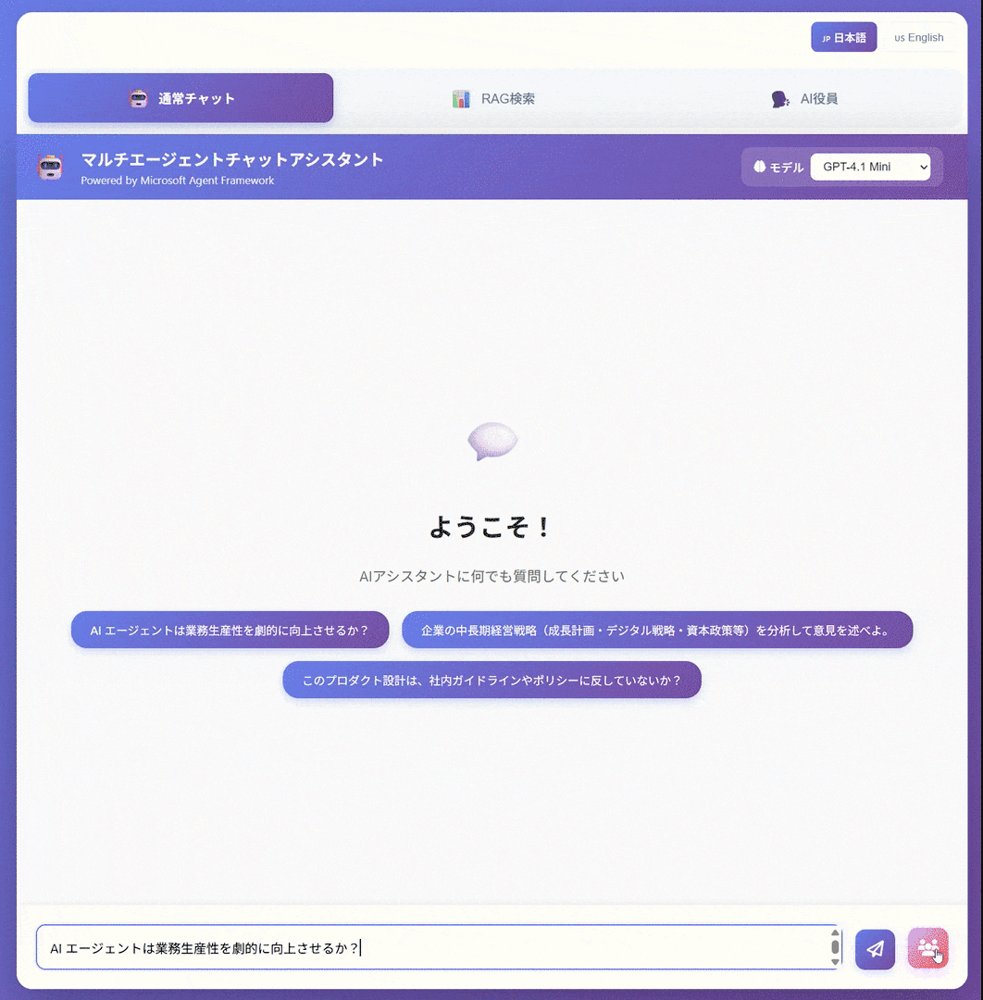
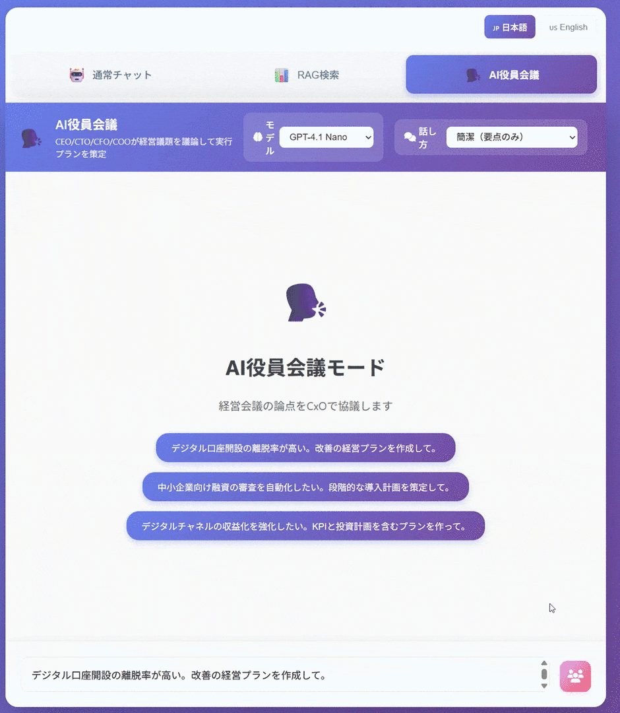

# Concurrent Streaming Demo with Microsoft Agent Framework

ワークフローで**複数エージェントを並列実行**しつつ、生成中の出力を**ストリーミング表示**するPythonデモです。
ブラウザ→Frontend(Flask)→Backend(FastAPI)の2段構成で、HTTP Chunked Transferを使って「出力が届き次第UIに描画」します。

> English version: [README.md](README.md)

## 関連ドキュメント

- [Agent機能デモの拡張案](docs/agent-demo-expansion.ja.md)

## 機能紹介（このリポジトリでできること）

- **通常チャット（Text streaming）**: 1エージェントの出力をトークン/チャンク単位で表示
- **マルチエージェント分析（ConcurrentBuilder）**: 2エージェントを並列実行（Critical / Positive）し、最後にSynthesizerが統合
- **RAG検索（Text streaming）**: Azure AI Search（任意）を使った参照（出典）付き応答
- **AI役員会議（GroupChatBuilder）**: CEO/CTO/CFO/COO が前の人の意見を踏まえながら順番に発言し、COOが実行計画をまとめる（tone指定あり）
- **計画可視化**: 各モードで回答前の goal / steps / tools / completion criteria を表示
- **承認フロー**: マルチエージェント分析 / AI役員会議 / 承認対象モデルの実行前に `approve / reject / revise` を要求
- **実行ログと根拠表示**: RAG検索で検索語・結果件数・所要時間・参照文書の抜粋を回答と分離して表示
- **ファイル入力対応**: `.txt / .md / .csv / .json / .pdf / .docx / .png / .jpg / .jpeg / .webp / .gif` を各モードへ添付し、モデル能力に応じてテキスト文脈またはマルチモーダル入力として回答へ反映
- **モデル選択**: Frontend は Backend から利用可能モデル一覧と provider 情報を受け取り、選択肢を Backend 設定と自動的に揃える
- **会話履歴メモリ**: BackendがAgent Frameworkの`AgentThread`をJSONへ永続化し、Frontendの表示履歴もJSONへ保持するため再起動後も継続会話できる
- **Gemini切替対応**: OpenAI / Azure OpenAI / Gemini Developer API / Vertex AI Gemini を provider 単位で切り替え可能
- **Agent Routing**: 通常チャット画面から Auto Route を実行すると、`通常チャット / RAG検索 / マルチエージェント分析 / AI役員会議` を自動選択
- **Quality Review**: 各モードの回答後に evaluator agent が `score / strengths / risks / missing info / next step` を返し、回答品質を可視化
- **Mission Queue**: 各モードのプロンプトを非同期ジョブとして投入し、右側の Mission Queue で進捗と結果を追跡
- **Ops Ledger**: 左側レールで実行回数・トークン量・推定コストを集計し、各回答には監査ログを添付表示
- **Crew Access**: Backend 定義の demo user / workspace を Frontend で切り替え、shared/private workspace ごとに会話履歴・添付・ジョブ・監査ログを分離


### マルチエージェント分析（ConcurrentBuilder）


### AI役員会議（GroupChatBuilder）


## アーキテクチャ概要

- **Frontend**: Flask（port 5001）
    - ブラウザへHTML/JSを配信
    - ブラウザからのリクエストを受け、Backendにストリーミングで中継（プロキシ）
- **Backend**: FastAPI（port 8000）
    - Microsoft Agent Frameworkを使ってエージェント実行
    - セッション単位で`AgentThread`と添付ファイル情報をJSONへ永続化し、会話履歴を次の回答へ反映
    - `.env` の provider 別モデル設定を読み込み、安全なモデル一覧だけを Frontend に公開
    - Azure OpenAI / OpenAI / Gemini Developer API / Vertex AI Gemini を呼び出し、結果をストリーミング返却

主要な呼び出し経路（例: 通常チャット）:

```
Browser (Fetch streaming)
    -> Frontend: POST /api/chat/stream
        -> Backend: POST /api/stream
            -> 設定済みモデル provider（Azure OpenAI / OpenAI / Gemini / Vertex AI Gemini）
```

## 必要要件

- Python 3.10以上
- Podman / Podman Desktop
- `podman-compose`
- （推奨）Windows + PowerShell
- Azureへデプロイする場合: Azure CLI（`az`）

## セットアップ（ローカル）

### 1) 依存関係のインストール

任意の仮想環境でOKです（venv / condaなど）。

```powershell
python -m venv .venv
.\.venv\Scripts\Activate.ps1

pip install -r .\Backend\requirements.txt
pip install -r .\Frontend\requirements.txt
```

> `start.ps1` / `start.bat` は、現在のPython実行環境でそのまま起動します。実行前に venv/conda などの環境を有効化してください。

### 2) 環境変数（Backend: Azure OpenAI / OpenAI / Gemini / Vertex AI Gemini）

Backendは起動時に`Backend/.env`を読み込みます。
`Backend/.env.example` を `Backend/.env` にコピーして値を設定してください（**秘密情報はコミットしない**）。

```
LLM_MODELS=openai-gpt-4-1-mini,openai-gpt-4-1-nano,openai-gpt-4-1,openai-gpt-5-mini,openai-gpt-5-nano,openai-gpt-5,gemini-2-5-flash,vertex-gemini-2-5-flash
DEFAULT_MODEL=openai-gpt-4-1-mini

LLM_MODEL_OPENAI_GPT_4_1_MINI_PROVIDER=openai
LLM_MODEL_OPENAI_GPT_4_1_MINI_LABEL=GPT-4.1 Mini (OpenAI)
LLM_MODEL_OPENAI_GPT_4_1_MINI_API_KEY=...
LLM_MODEL_OPENAI_GPT_4_1_MINI_MODEL_ID=gpt-4-1-mini

LLM_MODEL_OPENAI_GPT_4_1_NANO_PROVIDER=openai
LLM_MODEL_OPENAI_GPT_4_1_NANO_API_KEY=...
LLM_MODEL_OPENAI_GPT_4_1_NANO_MODEL_ID=gpt-4-1-nano

LLM_MODEL_OPENAI_GPT_4_1_PROVIDER=openai
LLM_MODEL_OPENAI_GPT_4_1_API_KEY=...
LLM_MODEL_OPENAI_GPT_4_1_MODEL_ID=gpt-4-1

LLM_MODEL_OPENAI_GPT_5_MINI_PROVIDER=openai
LLM_MODEL_OPENAI_GPT_5_MINI_API_KEY=...
LLM_MODEL_OPENAI_GPT_5_MINI_MODEL_ID=gpt-5-mini
# LLM_MODEL_OPENAI_GPT_5_MINI_REQUIRES_APPROVAL=true
# LLM_MODEL_OPENAI_GPT_5_MINI_APPROVAL_REASON=高コストモデルのためユーザー承認が必要

LLM_MODEL_OPENAI_GPT_5_NANO_PROVIDER=openai
LLM_MODEL_OPENAI_GPT_5_NANO_API_KEY=...
LLM_MODEL_OPENAI_GPT_5_NANO_MODEL_ID=gpt-5-nano

LLM_MODEL_OPENAI_GPT_5_PROVIDER=openai
LLM_MODEL_OPENAI_GPT_5_API_KEY=...
LLM_MODEL_OPENAI_GPT_5_MODEL_ID=gpt-5

LLM_MODEL_GEMINI_2_5_FLASH_PROVIDER=gemini
LLM_MODEL_GEMINI_2_5_FLASH_LABEL=Gemini 2.5 Flash (Gemini API)
LLM_MODEL_GEMINI_2_5_FLASH_API_KEY=...
LLM_MODEL_GEMINI_2_5_FLASH_MODEL_ID=gemini-2.5-flash
LLM_MODEL_GEMINI_2_5_FLASH_SUPPORTS_MULTIMODAL=true
LLM_MODEL_GEMINI_2_5_FLASH_SUPPORTS_IMAGE_INPUT=true
LLM_MODEL_GEMINI_2_5_FLASH_SUPPORTS_PDF_INPUT=true

LLM_MODEL_VERTEX_GEMINI_2_5_FLASH_PROVIDER=vertex_gemini
LLM_MODEL_VERTEX_GEMINI_2_5_FLASH_LABEL=Gemini 2.5 Flash (Vertex AI)
LLM_MODEL_VERTEX_GEMINI_2_5_FLASH_MODEL_ID=gemini-2.5-flash
LLM_MODEL_VERTEX_GEMINI_2_5_FLASH_PROJECT=your-gcp-project
LLM_MODEL_VERTEX_GEMINI_2_5_FLASH_LOCATION=us-central1
# LLM_MODEL_VERTEX_GEMINI_2_5_FLASH_CREDENTIALS_PATH=/path/to/service-account.json
LLM_MODEL_VERTEX_GEMINI_2_5_FLASH_SUPPORTS_MULTIMODAL=true
LLM_MODEL_VERTEX_GEMINI_2_5_FLASH_SUPPORTS_IMAGE_INPUT=true
LLM_MODEL_VERTEX_GEMINI_2_5_FLASH_SUPPORTS_PDF_INPUT=true

# OpenAI 互換ゲートウェイを使う場合は任意で設定:
# LLM_MODEL_OPENAI_GPT_4_1_MINI_ENDPOINT=https://api.openai.com/v1
# LLM_MODEL_OPENAI_GPT_4_1_MINI_ORG_ID=org_xxx
# LLM_MODEL_OPENAI_GPT_5_MINI_ENDPOINT=https://api.openai.com/v1
# LLM_MODEL_OPENAI_GPT_5_MINI_ORG_ID=org_xxx
```

モデル別 env のサフィックス変換ルール:

- `openai-gpt-5-mini` -> `OPENAI_GPT_5_MINI`
- `openai-gpt-4-1-mini` -> `OPENAI_GPT_4_1_MINI`

provider ごとの必須項目:

- `azure`: `PROVIDER`, `API_KEY`, `ENDPOINT`, `DEPLOYMENT`
- `openai`: `PROVIDER`, `API_KEY`, `MODEL_ID`
- `gemini`: `PROVIDER`, `API_KEY`, `MODEL_ID`
- `vertex_gemini`: `PROVIDER`, `MODEL_ID`, `PROJECT`, `LOCATION`

補足:

- `LLM_MODELS` は Frontend に公開するモデル別名の一覧です。同じモデル系統を Azure/OpenAI の両方で出したい場合は、別名を重複しないようにしてください。
- `DEFAULT_MODEL` は `LLM_MODELS` に含まれる別名を指定してください。
- `ENDPOINT` は Azure では必須、OpenAI では任意です。OpenAI では API の base URL として扱います。
- `ENDPOINT` は Gemini / Vertex AI Gemini でも任意です。SDK 既定の接続先を使う場合は不要です。
- `API_VERSION` は Azure / Gemini / Vertex AI Gemini で任意です。
- `REQUIRES_APPROVAL=true` を付けると、そのモデル選択時に Frontend で承認ダイアログを表示します。
- `APPROVAL_REASON` を設定すると、承認ダイアログへ理由をそのまま表示します。
- `openai-gpt-5-mini` のような別名を使う場合、env の接頭辞は `LLM_MODEL_OPENAI_GPT_5_MINI_*` になります。
- `SUPPORTS_MULTIMODAL=true` にすると、そのモデルを PDF / 画像入力対応として Frontend に公開します。画像は `SUPPORTS_IMAGE_INPUT=true`、PDF は `SUPPORTS_PDF_INPUT=true` で個別制御できます。
- Vertex AI Gemini は `google-genai` SDK を通して接続します。`CREDENTIALS_PATH` を省略する場合は、Application Default Credentials を事前に構成してください。
- `BACKEND_SESSION_STORE_PATH` を指定すると、Backend の会話履歴と添付ファイルメタデータの保存先を変更できます。省略時は `Backend/data/backend_sessions` です。
- `BACKEND_UPLOAD_STORE_PATH` を指定すると、PDF / 画像の原本を保存する場所を変更できます。省略時は `Backend/data/backend_upload_assets` です。
- `PLAN_TIMEOUT_SECONDS` は回答前の plan 生成に使う上限秒数です。タイムアウト時は fallback plan に切り替えて本回答を継続します。
- `ROUTE_TIMEOUT_SECONDS` は Auto Route 用の router 判定に使う上限秒数です。タイムアウト時はヒューリスティック判定へフォールバックします。
- `ENABLE_EVALUATION_AGENT` と `EVALUATION_TIMEOUT_SECONDS` で回答後の quality review 実行有無と上限秒数を制御できます。
- `DEMO_USERS_JSON` / `DEMO_WORKSPACES_JSON` / `DEFAULT_DEMO_USER` / `DEFAULT_DEMO_WORKSPACE` を設定すると、Frontend 左レールの `Crew Access` と Backend の shared/private workspace スコープを任意のデモ構成へ差し替えられます。
- `BACKEND_JOB_STORE_PATH` で非同期ジョブの JSON 永続化先を変更できます。
- `BACKEND_AUDIT_STORE_PATH` で監査ログの JSON 永続化先を変更できます。
- `INPUT_COST_PER_1K_TOKENS` / `OUTPUT_COST_PER_1K_TOKENS` / `CURRENCY` をモデルごとに設定すると、Ops Ledger で推定コストを集計できます。

（任意）Azure AI Searchを使う場合（RAG検索）:

```
SEARCH_ENDPOINT=https://<your-search>.search.windows.net
SEARCH_API_KEY=...
SEARCH_INDEX_NAME=...
SEARCH_SEMANTIC_CONFIG=default
```

（任意）言語切り替え:

```
LANGUAGE=ja
# または
LANGUAGE=en
```

※Backendは起動時に`LANGUAGE`を読み込むため、変更後はBackendの再起動が必要です。

ファイル入力の制限:

- 対応形式: `.txt`, `.md`, `.csv`, `.json`, `.pdf`, `.docx`, `.png`, `.jpg`, `.jpeg`, `.webp`, `.gif`
- セッションごとの最大添付数: `MAX_UPLOAD_FILES`
- 1ファイルあたりの最大サイズ: `MAX_UPLOAD_FILE_SIZE_BYTES`
- 抽出テキストの保持上限: `MAX_UPLOAD_TEXT_CHARS`
- プロンプトへ注入する添付テキスト上限: `MAX_PROMPT_DOCUMENT_CHARS`
- PDF / 画像は、選択中モデルが `SUPPORTS_PDF_INPUT` / `SUPPORTS_IMAGE_INPUT` を持つ場合にマルチモーダル入力として送信されます
- PDF からテキスト抽出できた場合は、テキスト専用モデルでもその抜粋を文脈として利用できます

（任意）既存環境向けの Azure 専用旧形式 env もフォールバックとして引き続き利用できます:

```
AZURE_OPENAI_API_KEY=...
AZURE_OPENAI_ENDPOINT=https://<your-resource>.openai.azure.com/
AZURE_OPENAI_API_VERSION=2024-12-01-preview
AZURE_OPENAI_DEPLOYMENT=...
```

### 3) `podman-compose` で実行

`Backend/.env.example` を `Backend/.env` に、`Frontend/.env.example` を `Frontend/.env` にコピーして値を設定した後、リポジトリ直下で実行します。

補足: サービスの listen port は `Backend/.env` / `Frontend/.env` では管理せず、公開する host port は `podman-compose.yml` を唯一の設定元にしています。

```bash
podman-compose -f podman-compose.yml up --build
```

起動後:

- Frontend: http://localhost:5001
- Backend: http://localhost:8000

停止:

```bash
podman-compose -f podman-compose.yml down
```

### 4) 個別起動（補足）

#### A. 個別起動（推奨：環境依存が少ない）

ターミナルを2つ開きます。

Backend:

```powershell
cd .\Backend
python -m uvicorn app:app --host 127.0.0.1 --port 8000 --reload
```

Frontend:

```powershell
cd .\Frontend
python app.py
```

起動後:

- Frontend: http://localhost:5001
- Backend: http://localhost:8000

#### B. 同時起動スクリプト

```powershell
# PowerShell
.\start.ps1

# もしくは cmd / PowerShell
.\start.bat
```

開発用（auto-reloadを強める）:

```powershell
.\start-dev.ps1
# または
.\start-dev.bat
```

### 5) Frontend の環境変数（任意）

Frontendは`BACKEND_URL`を見てBackendに接続します。

```powershell
$env:BACKEND_URL = "http://localhost:8000"
$env:LANGUAGE = "ja"
python .\Frontend\app.py
```

補足:

- `FRONTEND_MESSAGE_STORE_PATH` を指定すると、Frontend が保持する描画用履歴の保存先を変更できます。省略時は `Frontend/data/frontend_messages` です。
- `podman-compose.yml` では Backend / Frontend ともに `/app/data` を named volume にしているため、`podman-compose down` の後も履歴は残ります。完全に消す場合は `podman-compose down -v` を使ってください。

## 使い方（UI）

1. ブラウザで http://localhost:5001 を開く
2. 入力欄にプロンプトを入れて送信
3. ボタンでモードを切替（通常 / マルチ / RAG / 井戸端）
4. `model`セレクターは Backend 設定から自動生成されるので、その中から利用するモデルを選択

## Azure Container Apps へデプロイ

このリポジトリはBackend(FastAPI)とFrontend(Flask)を**別々のContainer App**としてデプロイします。
デプロイはscripts/deploy-aca.ps1で自動化されています。

### 前提条件

- Azure CLI（`az`）をインストール済み
- `az login` 済み
- リソース作成権限（Resource Group / ACR / Log Analytics / Container Apps）
- PowerShell 7（`pwsh`）推奨（Windows PowerShell 5.1でも可）

### 必須の環境変数（Backend 作成時）

PowerShellで以下を設定してから実行します（スクリプトは**Backend初回作成時**に必須チェックを行います）。

```powershell
$env:LLM_MODELS = "openai-gpt-4-1-mini,openai-gpt-4-1-nano,openai-gpt-4-1,openai-gpt-5-mini,openai-gpt-5-nano,openai-gpt-5"
$env:DEFAULT_MODEL = "openai-gpt-4-1-mini"

$env:LLM_MODEL_OPENAI_GPT_4_1_MINI_PROVIDER = "openai"
$env:LLM_MODEL_OPENAI_GPT_4_1_MINI_API_KEY = "..."
$env:LLM_MODEL_OPENAI_GPT_4_1_MINI_MODEL_ID = "gpt-4-1-mini"

$env:LLM_MODEL_OPENAI_GPT_5_MINI_PROVIDER = "openai"
$env:LLM_MODEL_OPENAI_GPT_5_MINI_API_KEY = "..."
$env:LLM_MODEL_OPENAI_GPT_5_MINI_MODEL_ID = "gpt-5-mini"
```

デプロイスクリプトは旧来の Azure 専用 `AZURE_OPENAI_*` 環境変数もフォールバックとして受け付けます。

（任意）Azure AI Search:

```powershell
$env:SEARCH_ENDPOINT = "https://<your-search>.search.windows.net"
$env:SEARCH_API_KEY = "..."
$env:SEARCH_INDEX_NAME = "..."
$env:SEARCH_SEMANTIC_CONFIG = "default"
```

### デプロイ実行

```powershell
pwsh .\scripts\deploy-aca.ps1 -Location japaneast -ResourceGroup concurrent-streaming-demo-rg

# Windows PowerShell 5.1 の場合
powershell -File .\scripts\deploy-aca.ps1 -Location japaneast -ResourceGroup concurrent-streaming-demo-rg
```

（任意）サブスクリプション指定:

```powershell
pwsh .\scripts\deploy-aca.ps1 -SubscriptionId <your-subscription-id> -ResourceGroup concurrent-streaming-demo-rg
```

作成/更新されるもの（概要）:

- Resource Group
- Azure Container Registry（`az acr build`でBackend/Frontendをビルド）
- Log Analytics Workspace
- Container Apps Environment
- Container Apps
    - Backend: ingress internal / port 8000
    - Frontend: ingress external / port 5001（`BACKEND_URL=http://concurrent-streaming-backend` を設定）

完了するとFrontendのURL（`https://<fqdn>`）が出力されます。

#### Frontend だけ更新したい場合

```powershell
pwsh .\scripts\deploy-aca.ps1 -FrontendOnly -ResourceGroup concurrent-streaming-demo-rg
```

## トラブルシューティング

- **何も返らない / 設定不足**: `Backend/.env`のAzure OpenAI設定（API key/endpoint/deployment）を確認
- **429 (Too Many Requests)**: 同時実行が多いとAzure OpenAI側の制限に当たりやすいので、負荷試験の同時数を下げる/モデルを軽くする

## ライセンス

MIT License
