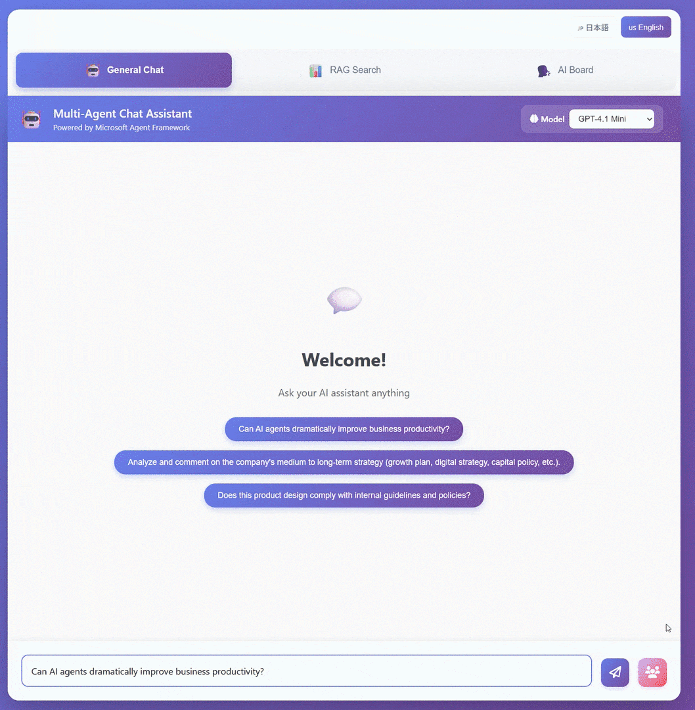
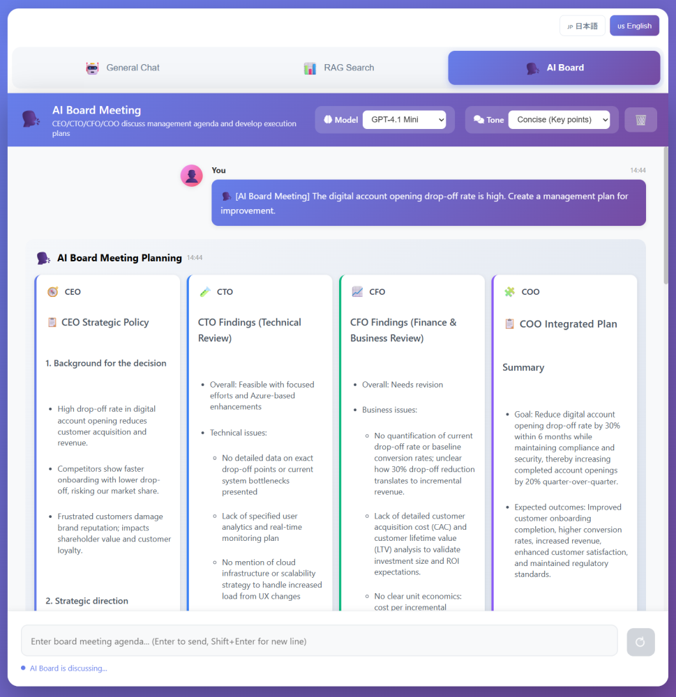

# Concurrent Streaming Demo with Microsoft Agent Framework

This is a Python demo that **runs multiple agents in parallel** inside a workflow and **streams partial outputs** while generation is in progress.
It is a 2-tier setup: Browser → Frontend (Flask) → Backend (FastAPI). It uses HTTP Chunked Transfer so the UI can render output as soon as it arrives.

> 日本語版: [README.ja.md](README.ja.md)

## Related Docs

- [Agent demo expansion ideas](docs/agent-demo-expansion.md)

## Feature Overview (What you can do in this repo)

- **Regular chat (Text streaming)**: Display a single agent’s output token/chunk by token/chunk
- **Multi-agent analysis (ConcurrentBuilder)**: Run two agents in parallel (Critical / Positive), then a Synthesizer merges the results
- **RAG search (Text streaming)**: Referenced responses using Azure AI Search (optional)
- **AI board meeting (GroupChatBuilder)**: The CEO, CTO, CFO, and COO speak in turn, building on each other's points, with the COO compiling the implementation plan. (with `tone`)
- **Plan visualization**: Each mode shows goal / steps / tools / completion criteria before the answer streams
- **Approval flow**: Multi-agent analysis, the board workflow, and approval-gated models require `approve / reject / revise` before execution
- **Execution trace and evidence view**: RAG search shows query, hit count, duration, and supporting document excerpts separately from the answer
- **File input support**: Attach `.txt / .md / .csv / .json / .pdf / .docx / .png / .jpg / .jpeg / .webp / .gif` files in each mode and use them either as text context or as multimodal inputs depending on model capability
- **Model selection**: The frontend receives the available model list and provider metadata from the backend, so selectable models stay aligned with backend configuration
- **Conversation memory**: The Backend persists Agent Framework `AgentThread` state to JSON, and the Frontend persists rendered history to JSON, so sessions survive restarts
- **Gemini switching**: OpenAI / Azure OpenAI / Gemini Developer API / Vertex AI Gemini can be switched per provider
- **Agent routing**: From the general chat screen, Auto Route can choose between `general chat / RAG search / multi-agent analysis / AI board meeting`
- **Quality review**: After each answer, an evaluator agent returns `score / strengths / risks / missing info / next step` so response quality is visible

### Multi-agent analysis (ConcurrentBuilder)


### AI board meeting (GroupChatBuilder)


## Architecture Overview

- **Frontend**: Flask (port 5001)
    - Serves HTML/JS to the browser
    - Receives browser requests and proxies them to the Backend with streaming
- **Backend**: FastAPI (port 8000)
    - Executes agents using Microsoft Agent Framework
    - Persists per-session `AgentThread` state and uploaded-file metadata to JSON, then uses it for follow-up answers
    - Reads provider-aware model settings from `.env`, then exposes the safe model list to the frontend
    - Calls Azure OpenAI / OpenAI / Gemini Developer API / Vertex AI Gemini and streams the output back

Main call path (example: regular chat):

```
Browser (Fetch streaming)
    -> Frontend: POST /api/chat/stream
        -> Backend: POST /api/stream
            -> Configured model provider (Azure OpenAI / OpenAI / Gemini / Vertex AI Gemini)
```

## Requirements

- Python 3.10+
- Podman / Podman Desktop
- `podman-compose`
- (Recommended) Windows + PowerShell
- For Azure deployment: Azure CLI (`az`)

## Setup (Local)

### 1) Install dependencies

Any virtual environment is fine (venv / conda, etc.).

```powershell
python -m venv .venv
.\.venv\Scripts\Activate.ps1

pip install -r .\Backend\requirements.txt
pip install -r .\Frontend\requirements.txt
```

> `start.ps1` / `start.bat` run servers using the current Python environment. Activate your venv/conda environment before running them.

### 2) Environment variables (Backend: Azure OpenAI / OpenAI / Gemini / Vertex AI Gemini)

The Backend loads `Backend/.env` at startup.
Copy `Backend/.env.example` to `Backend/.env` and set the values (**do not commit secrets**).

```
LLM_MODELS=openai-gpt-4-1-mini,openai-gpt-4-1-nano,openai-gpt-4-1,openai-gpt-5-mini,openai-gpt-5-nano,openai-gpt-5,gemini-2-5-flash,vertex-gemini-2-5-flash
DEFAULT_MODEL=openai-gpt-4-1-mini

LLM_MODEL_OPENAI_GPT_4_1_MINI_PROVIDER=openai
LLM_MODEL_OPENAI_GPT_4_1_MINI_LABEL=GPT-4.1 Mini (OpenAI)
LLM_MODEL_OPENAI_GPT_4_1_MINI_API_KEY=...
LLM_MODEL_OPENAI_GPT_4_1_MINI_MODEL_ID=gpt-4-1-mini

LLM_MODEL_OPENAI_GPT_4_1_NANO_PROVIDER=openai
LLM_MODEL_OPENAI_GPT_4_1_NANO_API_KEY=...
LLM_MODEL_OPENAI_GPT_4_1_NANO_MODEL_ID=gpt-4-1-nano

LLM_MODEL_OPENAI_GPT_4_1_PROVIDER=openai
LLM_MODEL_OPENAI_GPT_4_1_API_KEY=...
LLM_MODEL_OPENAI_GPT_4_1_MODEL_ID=gpt-4-1

LLM_MODEL_OPENAI_GPT_5_MINI_PROVIDER=openai
LLM_MODEL_OPENAI_GPT_5_MINI_API_KEY=...
LLM_MODEL_OPENAI_GPT_5_MINI_MODEL_ID=gpt-5-mini
# LLM_MODEL_OPENAI_GPT_5_MINI_REQUIRES_APPROVAL=true
# LLM_MODEL_OPENAI_GPT_5_MINI_APPROVAL_REASON=User approval is required for this higher-cost model

LLM_MODEL_OPENAI_GPT_5_NANO_PROVIDER=openai
LLM_MODEL_OPENAI_GPT_5_NANO_API_KEY=...
LLM_MODEL_OPENAI_GPT_5_NANO_MODEL_ID=gpt-5-nano

LLM_MODEL_OPENAI_GPT_5_PROVIDER=openai
LLM_MODEL_OPENAI_GPT_5_API_KEY=...
LLM_MODEL_OPENAI_GPT_5_MODEL_ID=gpt-5

LLM_MODEL_GEMINI_2_5_FLASH_PROVIDER=gemini
LLM_MODEL_GEMINI_2_5_FLASH_LABEL=Gemini 2.5 Flash (Gemini API)
LLM_MODEL_GEMINI_2_5_FLASH_API_KEY=...
LLM_MODEL_GEMINI_2_5_FLASH_MODEL_ID=gemini-2.5-flash
LLM_MODEL_GEMINI_2_5_FLASH_SUPPORTS_MULTIMODAL=true
LLM_MODEL_GEMINI_2_5_FLASH_SUPPORTS_IMAGE_INPUT=true
LLM_MODEL_GEMINI_2_5_FLASH_SUPPORTS_PDF_INPUT=true

LLM_MODEL_VERTEX_GEMINI_2_5_FLASH_PROVIDER=vertex_gemini
LLM_MODEL_VERTEX_GEMINI_2_5_FLASH_LABEL=Gemini 2.5 Flash (Vertex AI)
LLM_MODEL_VERTEX_GEMINI_2_5_FLASH_MODEL_ID=gemini-2.5-flash
LLM_MODEL_VERTEX_GEMINI_2_5_FLASH_PROJECT=your-gcp-project
LLM_MODEL_VERTEX_GEMINI_2_5_FLASH_LOCATION=us-central1
# LLM_MODEL_VERTEX_GEMINI_2_5_FLASH_CREDENTIALS_PATH=/path/to/service-account.json
LLM_MODEL_VERTEX_GEMINI_2_5_FLASH_SUPPORTS_MULTIMODAL=true
LLM_MODEL_VERTEX_GEMINI_2_5_FLASH_SUPPORTS_IMAGE_INPUT=true
LLM_MODEL_VERTEX_GEMINI_2_5_FLASH_SUPPORTS_PDF_INPUT=true

# Optional for OpenAI-compatible gateways:
# LLM_MODEL_OPENAI_GPT_4_1_MINI_ENDPOINT=https://api.openai.com/v1
# LLM_MODEL_OPENAI_GPT_4_1_MINI_ORG_ID=org_xxx
# LLM_MODEL_OPENAI_GPT_5_MINI_ENDPOINT=https://api.openai.com/v1
# LLM_MODEL_OPENAI_GPT_5_MINI_ORG_ID=org_xxx
```

Suffix rule for model-specific env vars:

- `openai-gpt-5-mini` -> `OPENAI_GPT_5_MINI`
- `openai-gpt-4-1-mini` -> `OPENAI_GPT_4_1_MINI`

Per-model required fields:

- `azure`: `PROVIDER`, `API_KEY`, `ENDPOINT`, `DEPLOYMENT`
- `openai`: `PROVIDER`, `API_KEY`, `MODEL_ID`
- `gemini`: `PROVIDER`, `API_KEY`, `MODEL_ID`
- `vertex_gemini`: `PROVIDER`, `MODEL_ID`, `PROJECT`, `LOCATION`

Notes:

- `LLM_MODELS` defines the model aliases exposed to the frontend; use unique aliases if you want to expose both Azure and OpenAI variants of the same model family.
- `DEFAULT_MODEL` must match one of the aliases in `LLM_MODELS`.
- `ENDPOINT` is required for Azure and optional for OpenAI. For OpenAI, `ENDPOINT` is treated as the API base URL.
- `ENDPOINT` is also optional for Gemini / Vertex AI Gemini. Leave it unset if you want the SDK default endpoint.
- `API_VERSION` is optional for Azure / Gemini / Vertex AI Gemini.
- `REQUIRES_APPROVAL=true` makes the frontend show an approval dialog before that model is used.
- `APPROVAL_REASON` is shown as-is in the approval dialog.
- With aliases such as `openai-gpt-5-mini`, the env prefix becomes `LLM_MODEL_OPENAI_GPT_5_MINI_*`.
- `SUPPORTS_MULTIMODAL=true` exposes the model to the frontend as PDF/image-capable. Use `SUPPORTS_IMAGE_INPUT=true` and `SUPPORTS_PDF_INPUT=true` for more granular control.
- Vertex AI Gemini uses the `google-genai` SDK. If `CREDENTIALS_PATH` is omitted, configure Application Default Credentials ahead of time.
- `BACKEND_SESSION_STORE_PATH` overrides where backend conversation history and uploaded-file metadata are stored. The default is `Backend/data/backend_sessions`.
- `BACKEND_UPLOAD_STORE_PATH` overrides where uploaded PDF/image assets are stored. The default is `Backend/data/backend_upload_assets`.
- `PLAN_TIMEOUT_SECONDS` controls how long the pre-answer planner is allowed to run. On timeout, the backend falls back to a default plan and continues with the main answer.
- `ROUTE_TIMEOUT_SECONDS` controls how long the Auto Route router is allowed to run. On timeout, the backend falls back to heuristic routing.
- `ENABLE_EVALUATION_AGENT` and `EVALUATION_TIMEOUT_SECONDS` control whether post-answer quality review runs and how long it may take.

(Optional) If you use Azure AI Search (RAG search):

```
SEARCH_ENDPOINT=https://<your-search>.search.windows.net
SEARCH_API_KEY=...
SEARCH_INDEX_NAME=...
SEARCH_SEMANTIC_CONFIG=default
```

(Optional) Language switch:

```
LANGUAGE=ja
# or
LANGUAGE=en
```

Note: the Backend reads `LANGUAGE` at startup, so you need to restart the Backend to apply changes.

File input limits:

- Supported types: `.txt`, `.md`, `.csv`, `.json`, `.pdf`, `.docx`, `.png`, `.jpg`, `.jpeg`, `.webp`, `.gif`
- Max attachments per session: `MAX_UPLOAD_FILES`
- Max size per file: `MAX_UPLOAD_FILE_SIZE_BYTES`
- Max extracted text retained per file: `MAX_UPLOAD_TEXT_CHARS`
- Max attached text injected into prompts: `MAX_PROMPT_DOCUMENT_CHARS`
- PDF/image files are sent as multimodal inputs when the selected model exposes `SUPPORTS_PDF_INPUT` / `SUPPORTS_IMAGE_INPUT`
- If text can be extracted from a PDF, text-only models can still use the extracted excerpt as context

(Optional) Legacy Azure-only env formats are still supported as fallbacks for existing setups:

```
AZURE_OPENAI_API_KEY=...
AZURE_OPENAI_ENDPOINT=https://<your-resource>.openai.azure.com/
AZURE_OPENAI_API_VERSION=2024-12-01-preview
AZURE_OPENAI_DEPLOYMENT=...
```

### 3) Run with `podman-compose`

Copy `Backend/.env.example` to `Backend/.env` and `Frontend/.env.example` to `Frontend/.env`, then run from the repository root:

Note: service listen ports are no longer configured in `Backend/.env` / `Frontend/.env`. `podman-compose.yml` is the single source of truth for published host ports.

```bash
podman-compose -f podman-compose.yml up --build
```

After startup:

- Frontend: http://localhost:5001
- Backend: http://localhost:8000

Stop:

```bash
podman-compose -f podman-compose.yml down
```

### 4) Run services separately

#### A. Run separately (recommended: fewer environment assumptions)

Open two terminals.

Backend:

```powershell
cd .\Backend
python -m uvicorn app:app --host 127.0.0.1 --port 8000 --reload
```

Frontend:

```powershell
cd .\Frontend
python app.py
```

After startup:

- Frontend: http://localhost:5001
- Backend: http://localhost:8000

#### B. Combined start scripts

```powershell
# PowerShell
.\start.ps1

# or cmd / PowerShell
.\start.bat
```

Dev mode (stronger auto-reload):

```powershell
.\start-dev.ps1
# or
.\start-dev.bat
```

### 5) Frontend environment variables (optional)

The Frontend connects to the Backend via `BACKEND_URL`.

```powershell
$env:BACKEND_URL = "http://localhost:8000"
$env:LANGUAGE = "ja"
python .\Frontend\app.py
```

Notes:

- `FRONTEND_MESSAGE_STORE_PATH` overrides where the frontend stores rendered message history. The default is `Frontend/data/frontend_messages`.
- `podman-compose.yml` mounts `/app/data` as a named volume for both services, so history survives `podman-compose down`. Use `podman-compose down -v` when you want to remove the persisted state.

## How to use (UI)

1. Open http://localhost:5001 in your browser
2. Enter a prompt and send
3. Switch modes via buttons (regular / multi / RAG / board meeting)
4. The `model` selector is populated from backend configuration; choose one of the exposed models

## Deploy to Azure Container Apps

This repo deploys Backend (FastAPI) and Frontend (Flask) as **separate Container Apps**.
Deployment is automated by scripts/deploy-aca.ps1.

### Prerequisites

- Azure CLI (`az`) installed
- Logged in via `az login`
- Permission to create resources (Resource Group / ACR / Log Analytics / Container Apps)
- PowerShell 7 (`pwsh`) recommended (Windows PowerShell 5.1 also works)

### Required environment variables (when creating the Backend)

Set these in PowerShell before running (the script validates them **only when the Backend is created for the first time**).

```powershell
$env:LLM_MODELS = "openai-gpt-4-1-mini,openai-gpt-4-1-nano,openai-gpt-4-1,openai-gpt-5-mini,openai-gpt-5-nano,openai-gpt-5"
$env:DEFAULT_MODEL = "openai-gpt-4-1-mini"

$env:LLM_MODEL_OPENAI_GPT_4_1_MINI_PROVIDER = "openai"
$env:LLM_MODEL_OPENAI_GPT_4_1_MINI_API_KEY = "..."
$env:LLM_MODEL_OPENAI_GPT_4_1_MINI_MODEL_ID = "gpt-4-1-mini"

$env:LLM_MODEL_OPENAI_GPT_5_MINI_PROVIDER = "openai"
$env:LLM_MODEL_OPENAI_GPT_5_MINI_API_KEY = "..."
$env:LLM_MODEL_OPENAI_GPT_5_MINI_MODEL_ID = "gpt-5-mini"
```

The deployment script also accepts the legacy Azure-only `AZURE_OPENAI_*` environment variables as a fallback.

(Optional) Azure AI Search:

```powershell
$env:SEARCH_ENDPOINT = "https://<your-search>.search.windows.net"
$env:SEARCH_API_KEY = "..."
$env:SEARCH_INDEX_NAME = "..."
$env:SEARCH_SEMANTIC_CONFIG = "default"
```

### Run deployment

```powershell
pwsh .\scripts\deploy-aca.ps1 -Location japaneast -ResourceGroup concurrent-streaming-demo-rg

# For Windows PowerShell 5.1
powershell -File .\scripts\deploy-aca.ps1 -Location japaneast -ResourceGroup concurrent-streaming-demo-rg
```

(Optional) Specify subscription:

```powershell
pwsh .\scripts\deploy-aca.ps1 -SubscriptionId <your-subscription-id> -ResourceGroup concurrent-streaming-demo-rg
```

What gets created/updated (high level):

- Resource Group
- Azure Container Registry (build Backend/Frontend via `az acr build`)
- Log Analytics Workspace
- Container Apps Environment
- Container Apps
    - Backend: ingress internal / port 8000
    - Frontend: ingress external / port 5001 (sets `BACKEND_URL=http://concurrent-streaming-backend`)

After completion, it prints the Frontend URL (`https://<fqdn>`).

#### Update only the Frontend

```powershell
pwsh .\scripts\deploy-aca.ps1 -FrontendOnly -ResourceGroup concurrent-streaming-demo-rg
```

## Troubleshooting

- **No response / missing configuration**: Check Azure OpenAI settings in `Backend/.env` (API key/endpoint/deployment)
- **429 (Too Many Requests)**: With high concurrency you may hit Azure OpenAI limits; reduce load-test concurrency / use a lighter model

## License

MIT License
